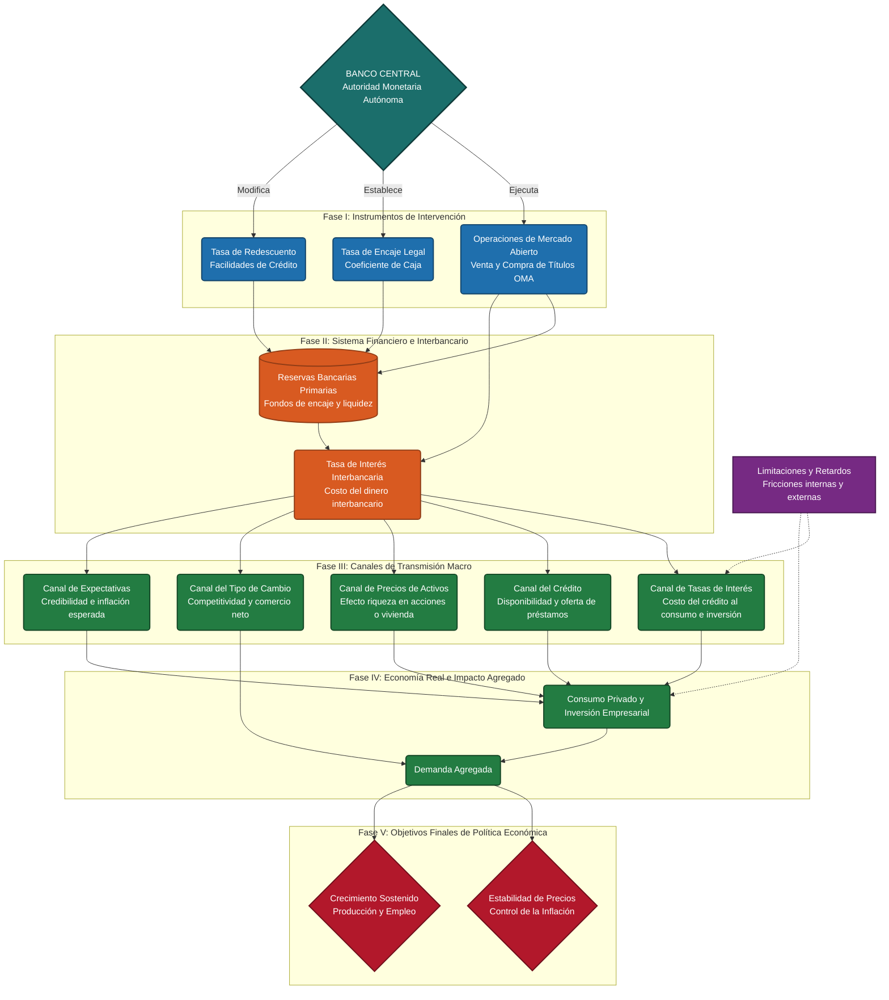

# Organizador Gráfico: La Política Monetaria como Instrumento de Política Económica

Este organizador gráfico ha sido estructurado siguiendo el formato de **Ruta Causal e Integración Conceptual** para representar de manera clara, jerárquica y analítica el Capítulo 11 del libro de Política Económica.

---

## 1. Diagrama de la Ruta Causal y Transmisión Monetaria

Este diagrama ilustra cómo las decisiones del Banco Central fluyen a través del sistema financiero hasta la economía real y las variables macroeconómicas finales.

---

## 2. Bloques Temáticos Detallados

### 2.1. Concepto de Política Monetaria
*   **Definición:** Conjunto de decisiones y acciones que la autoridad monetaria (Banco Central) adopta para regular la cantidad de dinero, la disponibilidad del crédito y el nivel de los tipos de interés en el sistema financiero.
*   **Papel en la Política Económica:** Instrumento de estabilización coyuntural y de control macroeconómico de corto plazo.
*   **Variables que Afecta:**
    *   *Líquidas e Intermedias:* Masa monetaria (M1, M2, M3), crédito disponible, tasas de interés activas y pasivas.
    *   *Reales e Internas:* Precios domésticos (inflación), producción agregada (PIB), empleo y las expectativas de los agentes económicos.

### 2.2. Objetivos de la Política Monetaria
La política monetaria persigue fines múltiples que pueden entrar en conflicto en el corto plazo (*trade-offs*):
*   **Estabilidad de Precios:** Minimizar las fluctuaciones de la inflación para preservar el poder adquisitivo de la moneda (Objetivo prioritario moderno).
*   **Crecimiento y Pleno Empleo:** Suavizar el ciclo económico apoyando la demanda agregada en periodos de recesión.
*   **Estabilidad Financiera:** Asegurar el correcto funcionamiento del sistema de pagos y prevenir crisis bancarias de liquidez.
*   **Estabilidad del Tipo de Cambio:** Controlar la depreciación/apreciación de la moneda frente a divisas fuertes para regular la competitividad externa y evitar la inflación importada.

### 2.3. Autoridad Monetaria y Autonomía
*   **El Banco Central:** Institución responsable de formular y ejecutar la política monetaria.
*   **La Importancia de la Autonomía:**
    *   *Credibilidad:* Evita que los gobiernos utilicen la emisión inorgánica de dinero para financiar déficits fiscales transitorios, lo que reduce la inflación esperada.
    *   *Inconsistencia Dinámica:* Soluciona la tentación política de generar inflación sorpresa en épocas electorales para expandir temporalmente el empleo a costa de alta inflación futura.
    *   *Toma de Decisiones Técnicas:* Separa los horizontes de planificación económica a largo plazo de las presiones de los ciclos políticos de corto plazo.

### 2.4. Estrategias de Política Monetaria
Modelos o marcos de acción para guiar la instrumentación:
1.  **Metas de Agregados Monetarios:** Control directo sobre el crecimiento del dinero (ej. M2) bajo el supuesto de una relación estable entre dinero e inflación.
2.  **Metas de Tipo de Interés:** Anclar la tasa de interés interbancaria de corto plazo para influir en las condiciones del mercado financiero.
3.  **Metas de Inflación (*Inflation Targeting*):** El Banco Central anuncia un rango meta explícito para la inflación a mediano plazo y utiliza la tasa de interés de referencia para ajustar las expectativas. No hay objetivos intermedios rígidos, sino que la propia previsión de inflación funciona como meta intermedia.

### 2.5. Instrumentos y sus Efectos Causales
Mecanismos de intervención y sus canales de impacto esperado:

| Instrumento | Acción | Efecto en Liquidez / Crédito | Impacto Causal en Economía |
| :--- | :--- | :--- | :--- |
| **Operaciones de Mercado Abierto (OMA)** | Venta de bonos del Banco Central | $\downarrow$ Reservas bancarias | $\uparrow$ Tasa interbancaria $\rightarrow$ $\downarrow$ Crédito $\rightarrow$ $\downarrow$ Demanda Agregada $\rightarrow$ $\downarrow$ Inflación. |
| | Compra de bonos del Banco Central | $\uparrow$ Reservas bancarias | $\downarrow$ Tasa interbancaria $\rightarrow$ $\uparrow$ Crédito $\rightarrow$ $\uparrow$ Demanda Agregada $\rightarrow$ $\uparrow$ Empleo. |
| **Encaje Bancario / Coeficiente de Caja** | Aumento del encaje legal obligatorio | $\downarrow$ Liquidez disponible para prestar | $\uparrow$ Tasas de interés comerciales $\rightarrow$ Restricción del crédito $\rightarrow$ Contracción de la DA. |
| | Reducción del encaje legal | $\uparrow$ Capacidad crediticia bancaria | $\downarrow$ Tasas de interés comerciales $\rightarrow$ Expansión del crédito $\rightarrow$ Estímulo de la DA. |
| **Redescuento / Facilidades de Liquidez** | Aumento de la tasa de redescuento | $\downarrow$ Incentivo a solicitar liquidez al BC | Restricción preventiva de la oferta de crédito bancario comercial. |
| | Reducción de la tasa de redescuento | $\uparrow$ Respaldo de liquidez para bancos | Los bancos comerciales prestan con mayor flexibilidad al sector privado. |

### 2.6. Efectividad de la Política Monetaria
Depende fundamentalmente de la estructura del mercado y del comportamiento de los agentes:
*   **Sensibilidad de la Inversión al Tipo de Interés:** Si la inversión es altamente sensible al costo del capital, pequeños cambios en las tasas generarán grandes efectos en el PIB.
*   **Sensibilidad de la Demanda de Dinero:** Si la demanda de dinero es muy elástica al interés (cercana a una trampa de liquidez), las inyecciones monetarias no reducirán las tasas de interés ni reactivarán la economía.
*   **Grado de Desarrollo Financiero:** Un sistema bancario profundo y competitivo propaga las señales de la tasa de interés de referencia más rápido hacia los créditos comerciales de los hogares.

### 2.7. Limitaciones de la Política Monetaria
Factores que restringen o anulan su impacto:
*   **Retardos Temporales:**
    *   *Retardo Interno:* Tiempo transcurrido entre el shock económico y la toma de la decisión monetaria (es muy corto).
    *   *Retardo Externo:* Tiempo que toma la decisión en transmitirse y alterar la producción y el empleo en la economía real (suele ser largo e variable: de 6 a 18 meses).
*   **Asimetría de la Política:** La política monetaria es muy efectiva para frenar la inflación (política contractiva, "tirar de una cuerda"), pero tiene baja efectividad para reactivar la economía en recesiones profundas si los bancos no quieren prestar o los agentes no quieren endeudarse (política expansiva, "empujar una cuerda").
*   **Inestabilidad de la Velocidad del Dinero ($V$):** Si la velocidad de circulación del dinero fluctúa bruscamente debido a cambios tecnológicos o desconfianza, se rompe el vínculo estable entre la oferta monetaria y los precios.

---

## 3. Recuadro Especial: Aplicación al Caso Ecuatoriano

### ¿Qué cambia en una economía dolarizada como Ecuador?
En el esquema de dolarización oficial adoptado en el año 2000, el Banco Central de Ecuador (BCE) perdió su capacidad de emitir moneda de curso legal de forma soberana. Esto reconfigura por completo la política monetaria nacional:

1.  **Imposibilidad de Emisión Primaria:** El BCE no puede realizar expansión cuantitativa ni emitir masa monetaria para financiar desequilibrios fiscales o inyectar liquidez directa en recesiones.
2.  **Inexistencia del Prestamista de Última Instancia genuino:** El BCE no puede rescatar automáticamente al sistema bancario en caso de corridas de depósitos mediante emisión monetaria de emergencia. Debe basarse en fondos de liquidez previamente constituidos con aportes de la banca privada.
3.  **Anulación del Tipo de Cambio:** Al no poseer moneda propia, el país no puede devaluar para corregir desequilibrios en la cuenta corriente ni amortiguar caídas en los precios internacionales de exportaciones (ej. petróleo).
4.  **Oferta Monetaria Exógena:** La liquidez total de la economía depende de los flujos de dólares que ingresan o salen del país mediante la balanza de pagos (exportaciones, inversión extranjera, remesas y endeudamiento público o privado).

#### ¿Qué instrumentos sí puede aplicar el BCE?
Aunque carece de política monetaria activa y convencional, el BCE aplica herramientas de **regulación de liquidez de segundo orden** y **estabilidad financiera**:
*   *Tasa de Encaje Obligatorio:* Modificar los requerimientos de reservas que los bancos comerciales deben depositar en el BCE.
*   *Tasas de Interés Máximas:* Establecer techos a las tasas de interés activas en diferentes segmentos crediticios bancarios para evitar la usura y regular el costo del financiamiento.
*   *Gestión del Sistema de Pagos:* Administrar los flujos de liquidez interbancaria y regular la salida de divisas.

---

## 4. Explicación Breve Escrita a Mano (Síntesis de una Página)

Respuestas conceptuales ultra-sintetizadas para transcripción a mano en una página:

*   **1. Idea central del Capítulo 11:** La política monetaria es un instrumento macroeconómico indirecto que gestiona la liquidez y las tasas de interés mediante el sistema financiero para estabilizar precios y empleo. Su efectividad depende de la credibilidad y autonomía del Banco Central para coordinar las expectativas de los agentes y evitar retardos internos o externos en su transmisión.
*   **2. Relación entre instrumentos, canales y objetivos:** El Banco Central activa instrumentos (OMA, encaje legal o redescuento) que alteran las reservas bancarias primarias y el tipo de interés interbancaria. Este shock se propaga por canales de transmisión (crédito, tasas, activos y expectativas), modificando el costo de financiamiento y ajustando la demanda agregada para alcanzar los objetivos finales de baja inflación y crecimiento.
*   **3. Efectos distintos en el corto y largo plazo:** En el corto plazo, debido a la rigidez temporal de precios y salarios, la masa monetaria influye sobre variables reales como la demanda, la producción y el empleo (no neutralidad). En el largo plazo, los precios se ajustan completamente, disipando el impacto real y generando solo un aumento proporcional del nivel de precios (neutralidad del dinero), haciendo que la inflación sea un fenómeno puramente monetario.
*   **4. Limitaciones en economía dolarizada (Ecuador):** Al perder la soberanía cambiaria y la emisión primaria de dinero, el país carece de prestamista de última instancia incondicional y tipo de cambio nominal para absorber shocks externos. La política monetaria nacional queda limitada al control micro-prudencial de la liquidez doméstica (encaje y coeficientes de liquidez) y a la regulación de techos de tasas de interés.
*   **5. Síntesis Final (¿Por qué no es uniforme el análisis?):** La política monetaria no puede analizarse igual en todos los países porque su efectividad depende del régimen cambiario y del grado de soberanía monetaria. Las economías dolarizadas como Ecuador no pueden emitir moneda propia ni anclar tasas de referencia activas, limitando al Banco Central a custodiar la liquidez doméstica frente a las fluctuaciones exógenas de la balanza de pagos.
